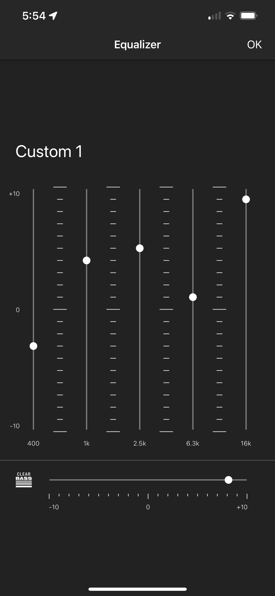

# Sony-WH-1000XM5
Equalizer preset for Sony WH-1000XM5

## Precondition

### Version 2.0 alpha

#### Internal Equalizer

#### Programs

You need [EasyEffects](https://github.com/wwmm/easyeffects) to load the equalizer settings file.

#### Impulse files

1) You need the Headphone Correction Filters from the [ASH-Listening-Set](https://github.com/ShanonPearce/ASH-Listening-Set) for the Sony WH-1000XM5:

`HpCF_Sony_WH_1000XM5.wav` from [folder HpCFs/FIRs_Stereo/Sony](https://github.com/ShanonPearce/ASH-Listening-Set/tree/main/HpCFs/FIRs_Stereo/Sony)

_[More info about this filter](https://github.com/ShanonPearce/ASH-Listening-Set/wiki/Headphone-Correction-Filters)_

2) You need the Diffuse-Field Target to ASH Over-Ear+On-Ear Target from the [ASH-Listening-Set](https://github.com/ShanonPearce/ASH-Listening-Set):

`Diffuse-Field_Target_to_ASH_Over-Ear+On-Ear_Target.wav` from [folder Additional_Filters/FIRs_Stereo](https://github.com/ShanonPearce/ASH-Listening-Set/tree/main/Additional_Filters/FIRs_Stereo)

_[More info about this filter](https://github.com/ShanonPearce/ASH-Listening-Set/wiki/Additional-Filters)_

3) You need the Low Frequency Roll-off Compensation from [ASH-Listening-Set](https://github.com/ShanonPearce/ASH-Listening-Set):

`Low_Frequency_Roll-off_Compensation.wav` from [folder Additional_Filters/FIRs_Stereo](https://github.com/ShanonPearce/ASH-Listening-Set/tree/main/Additional_Filters/FIRs_Stereo)

_[More info about this filter](https://github.com/ShanonPearce/ASH-Listening-Set/wiki/Additional-Filters)_

### Version 1.0

#### Internal Equalizer

Create a Equalizer in the App for the WH-1000XM5:

[Source](https://www.reddit.com/r/SonyHeadphones/comments/14plfz0/wh1000xm5_a_guide_for_maximizing_audio_quality/)

#### Programs

You need [EasyEffects](https://github.com/wwmm/easyeffects) to load the equalizer settings file.

#### Profiles

**_Clear_**

Open sound with high brights and deep bass down to bass woofer level.

Works best for natural recorded music without much editing, movies without many "sound effects" and similar.

**_Balanced_**

Open sound with high brights with a more balanced bass response.

Works best for semi-natural recorded music, where "bass enhancements" took place, or heavy compression was used. Works with some movies, if not too much bass effects were used.

**_Universal_**

Muted brights, with lower bass response and muted lower mids.

Works best for music which was heavily edited, like Agrotech, EDM, Pop Music, Hip-Hop and Movies with heavy soundeffects, where the bassline would just drown out the details otherwise. In short it's more for an easy listening experience where the sound editors expected bad playback devices.

## Usage

### Load the profile 

You can load the profile including the Equalizer settings from the most up-to-date version under `/profiles`.

### Additional information

Some filters are intentionally deactivated:

- `Deesser` might come handy on poor audio recordings on voice
- `Filter` comes handy on poor audio recordings with microphone rumbing
- `Noise Reduction` might come handy on *very* poor recordings of voice, where you may want to blend out background noise.

Note: The first equalizer are intentionally empty, it is used to reduce the input volume to roughtly the same amount the second EQ changes it. So it won't blow your ears out to deactivate the (real) second EQ, if you want to compare.

## Known issues

- <strike>Base is to "rumbly" on some tracks, especially Agrotech and Hip-Hop/Rap.</strike>
- <strike>Brights (around 3kHz) may sound to harsh on some tracks, especially Agrotech.</strike>
- Requires high volume listening, otherwise fill fall flat. Loudness filter on top does absolutly not help to improve this.
